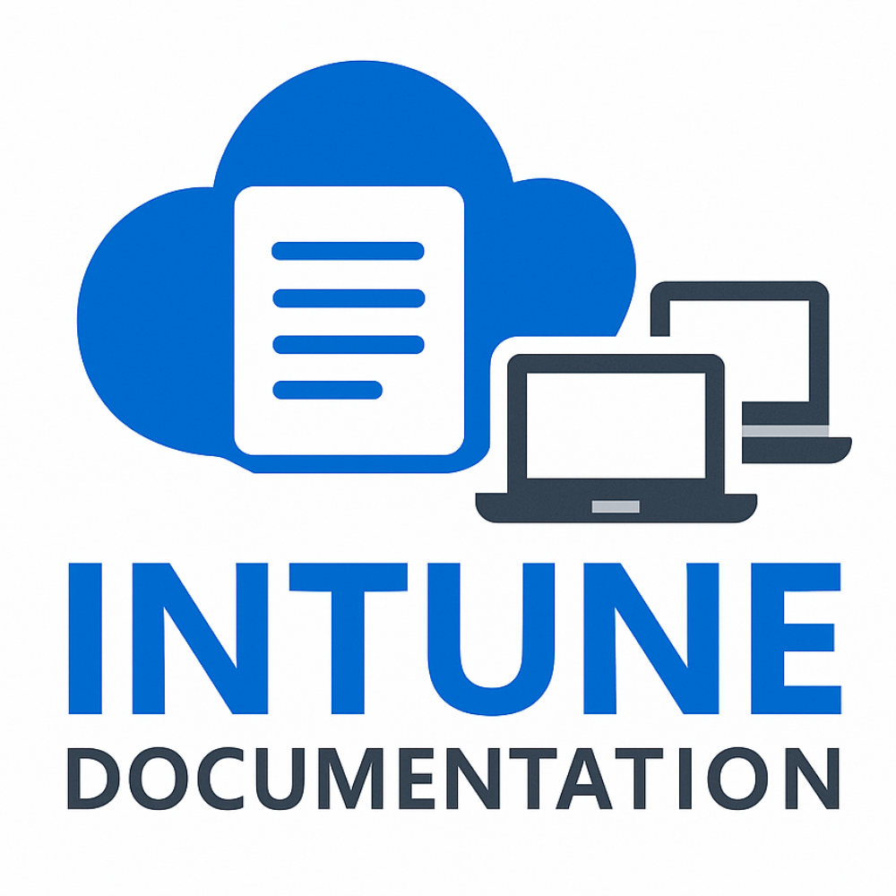
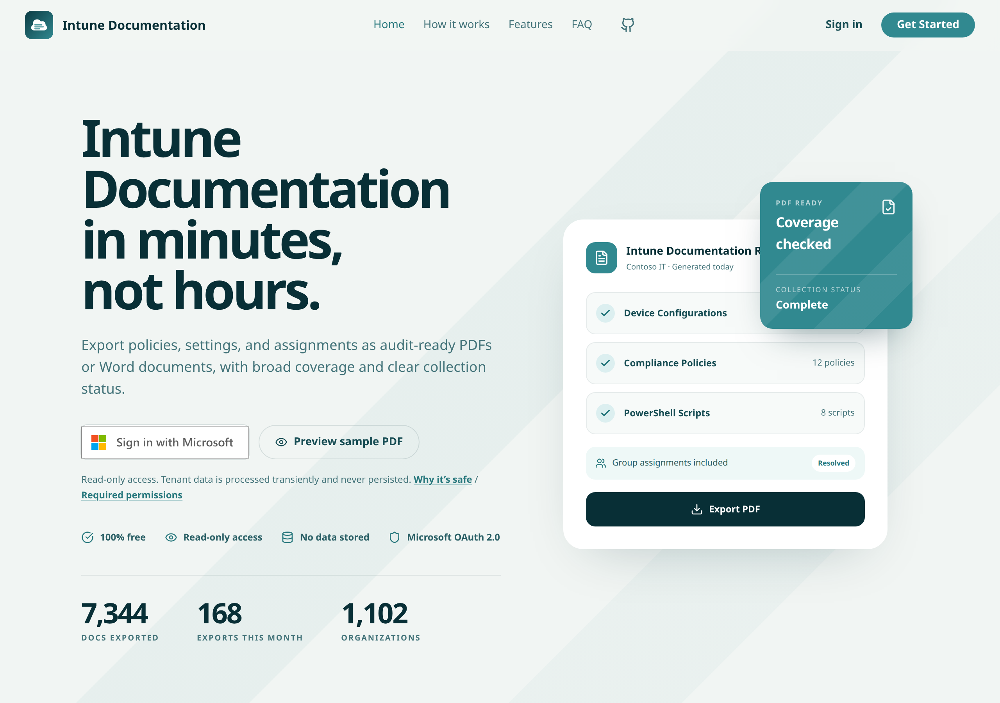

# Intune Documentation

<p align="center">
  
</p>

Intune Documentation is a Next.js web app that signs you into your Microsoft Entra tenant with MSAL, reads Intune configuration through delegated, read-only Microsoft Graph permissions, and creates professional PDF and Word documentation entirely in your browser. Intune configuration data never touches the application server.

Endpoint Security policies represented by Microsoft Graph as configuration policies, including policies created through Microsoft Defender for Endpoint security settings management, are handled as ordinary configuration policies. They appear in the existing Settings Catalog list and in the Settings Catalog chapter of PDF and Word exports, using the existing read-only permissions.

[](https://github.com/ugurkocde/IntuneDocumentation/actions/workflows/ci.yml)
[](LICENSE)

<p align="center">
  <a href="https://intunedocumentation.com">
    
  </a>
</p>

## Use the hosted version

Go to [intunedocumentation.com](https://intunedocumentation.com), sign in, and start documenting your tenant. On first use, an administrator may need to grant consent for the delegated Microsoft Graph permissions.

## Self-host with Docker

1. Copy [`compose.yaml`](compose.yaml) into a directory on your Docker host.
2. Create a `.env` file next to it:

   ```env
   AZURE_AD_CLIENT_ID="your-entra-application-client-id"
   # Optional. Defaults to "common".
   AZURE_AD_TENANT_ID="common"
   ```

3. Start the container:

   ```sh
   docker compose up -d
   ```

4. Open [http://localhost:3000](http://localhost:3000).

The image is published as `ghcr.io/ugurkocde/intune-documentation` with `latest`, `X.Y`, and `X.Y.Z` tags.

## Create the Entra app registration

Self-hosted deployments need a public client application registration:

1. In the [Microsoft Entra admin center](https://entra.microsoft.com), open **Identity > Applications > App registrations** and select **New registration**.
2. Choose the supported account type:
   - **Accounts in this organizational directory only** for a single-tenant deployment.
   - **Accounts in any organizational directory** if users from multiple tenants will use the deployment.
3. Under **Authentication**, add the **Single-page application** platform and a redirect URI that exactly matches the origin users will browse to, such as `http://localhost:3000` or `https://intune-docs.example.com`. The app uses the current browsing origin as its redirect URI at runtime.
4. Under **API permissions**, add these delegated Microsoft Graph permissions:
   - `User.Read`
   - `DeviceManagementConfiguration.Read.All`
   - `DeviceManagementApps.Read.All`
   - `DeviceManagementManagedDevices.Read.All`
   - `DeviceManagementRBAC.Read.All`
   - `DeviceManagementServiceConfig.Read.All`
   - `DeviceManagementScripts.Read.All`
   - `Group.Read.All`
5. Select **Grant admin consent** for the tenant.

All requested permissions are read-only. No client secret is needed for this browser-based MSAL application. Use the registration's application client ID for `AZURE_AD_CLIENT_ID`, and set `AZURE_AD_TENANT_ID` to your tenant ID for a single-tenant deployment or leave it as `common` for multitenant sign-in.

## Local development

```sh
npm install
cp .env.example .env
```

Set `NEXT_PUBLIC_AZURE_AD_CLIENT_ID` in `.env`, then start the development server:

```sh
npm run dev
```

Run the quality gates before submitting changes:

```sh
npm run check
npm run test
```

## Privacy and telemetry

Intune configuration data is fetched, processed, and exported in the browser. It is never sent to or stored by the application server.

The hosted site collects anonymized usage statistics through Plausible Analytics, stores hashed tenant and user identifiers to calculate monthly active users, and provides a Crisp support-chat widget. Self-hosted deployments disable all telemetry and support chat by default because Supabase and Crisp are not configured and the analytics flag is off.

## Contributing

See [CONTRIBUTING.md](CONTRIBUTING.md) for development setup and pull request guidance.

## Security

Report vulnerabilities privately by following [SECURITY.md](SECURITY.md).

## License

Intune Documentation is licensed under the [Elastic License 2.0](LICENSE). You may use, copy, modify, redistribute, and self-host the software, but you may not offer it to third parties as a hosted or managed service.
