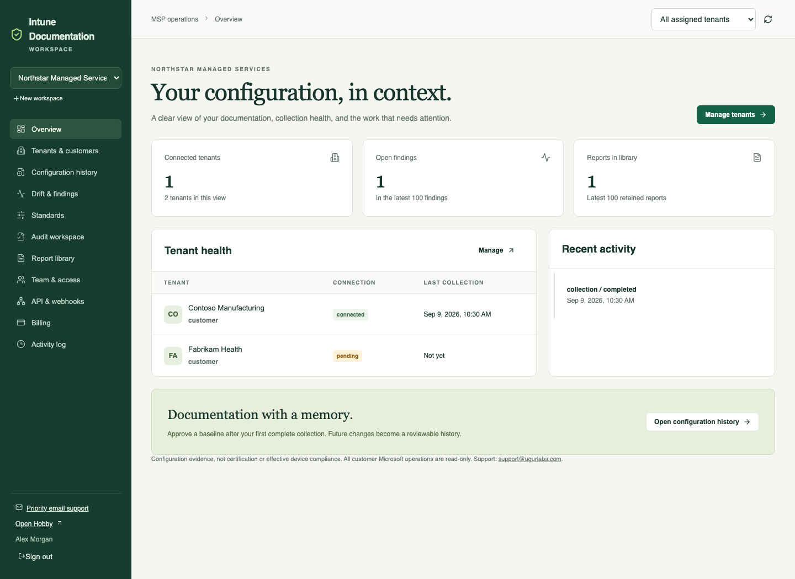
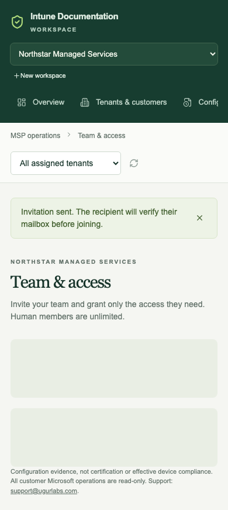
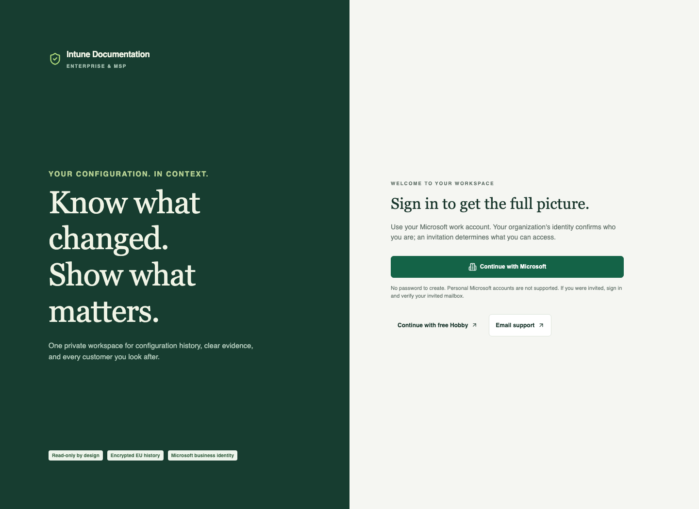

# Enterprise UI review

These screenshots show the actual workspace components rendered with synthetic browser-test fixtures. They are review examples, not a live customer account or evidence of Microsoft/Polar connectivity.

The browser suite exercises navigation, customer filters, evidence review, standard publication, invitations, mobile layout, Microsoft-only sign-in, and customer administrator approval. Run `npm run test:enterprise-ui` to reproduce them.

## Workspace overview

## Mobile team access

## Microsoft business sign-in

